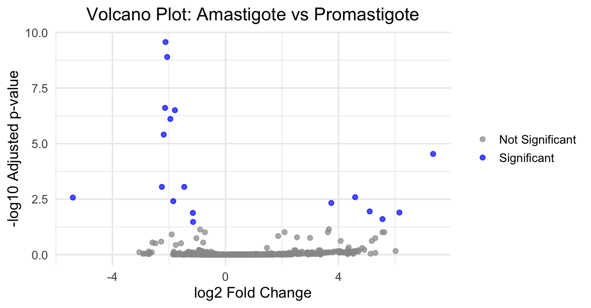
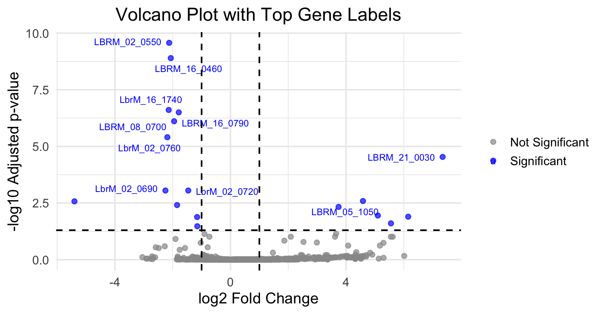
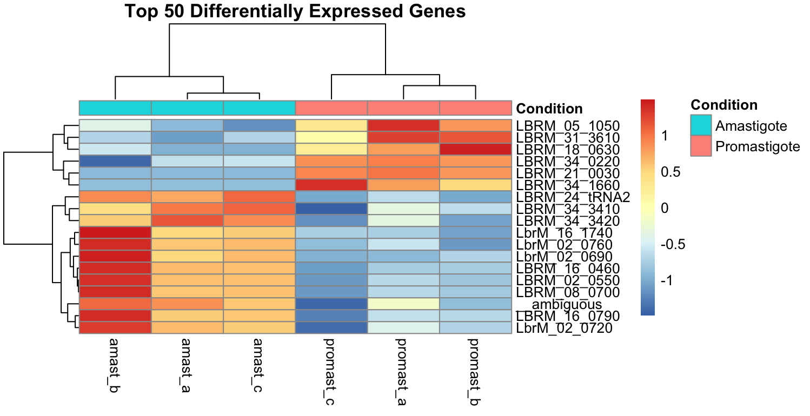
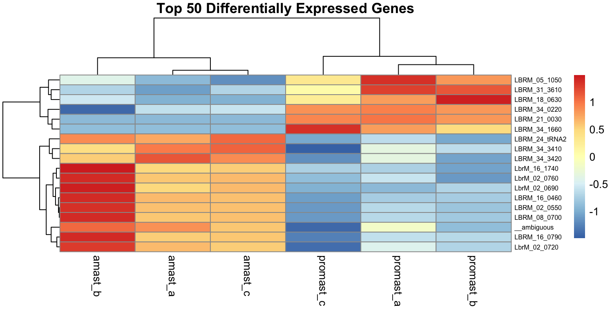

# Leishmania-braziliensis-RnaSeq-Analysis
Differential expression analysis using HiSAT2, HTSeq, and DESeq2 on Leishmania RNA expressions (amastigote vs promastigote). 

---------------------------------------------------------------------------
# Table of Contents
- Project Overview
- Software and Tools Used
- Data Preparation
- Workflow Summary
- Plots / Results
- Significant Gene Extractions
- Biological Interpretations
- File Output
- Reproductibility Notes

---------------------------------------------------------------------------
## 1. Project Overview

Leishmania braziliensis (L.braziliensis) is a parasitic protozoan that spreads via insect vectors (infected female Lutzomyia sandflies), causing cutaneous and mucocutaneous leishmaniasis across South America. It transitions across two major life stages, a promastigote stage within the sandfly vector, and an amastigote stage within human host cells. Comparing their gene expression profiles helps clarify how the parasites adapt to the vector and host environments. 

This project runs a RNA-seq workflow using HISAT2 to align raw FastQ files to a reference genome, samtools to read and create alignment files, HTSeq to count RNA-fragments, and DESeq2 in RStudio to log upregulated versus downregulated gene fragments. All to identify differentially expressed genes across amastigote and promastigote samples that highlight key transcriptional changes linked to host adaptation, stress responses and parasitic survival. 

All scripts, count files, DESeq2 outputs, and plots are included in this repository. Large raw datasets and BAM files are stored locally due to size constraints. 

This project was supervised by Dr Lizzie Wadsworth, following the workflow outlined in Section 4.

- Author: Lea M. M. Barre
- Contact: L.MBarre@outlook.com

## 2. Software and Tools Used

- HISAT2 v2.2.2
- FastQC v0.12.1
- samtools v1.24
- HTSeq-count v2.1.2
- R v4.6.1
- DESeq2 v1.52.0

## 3. Data Preparation

All RNA-seq datasets used in this project were downloaded from the European Nucleotide Archive (ENA) and are publicly available. The FastQ files used include paired-end reads for both amastigote and promastigote life stages, with three biological replicates per condition (forward and reverse reads for each replicate, totally 12 FastQ files).

All files followed a consistent naming convention:
- amastigote-SRR7945375_1a.fastq 
- amastigote-SRR7945375_2a.fastq
- promastigote-SRR7945368_1a.fastq
- promastigote-SRR7945368_2a.fastq
- etc...

Each filename encodes the condition, accession number, replicate and read direction (1: forward, 2: reverse). And a full list of filenames and all commands used during this project are provided in the appendix file.


## 4. Workflow Summary

**1. Alignment Workflow: (Terminal / Python)**

    > HISAT2 alignment

    Reads were aligned to the L. braziliensis reference genome (.fna, .gtf) using HISAT2. Each pair of FastQ files (forward and reverse reads) were used to produce a SAM file containing the initial alignment information.

    > Samtools sort

    SAM files were converted to BAM format, and sorted by genomic coordinates using samtools. This step ensures that downstream tools can efficiently read and process the alignment data. 

    > Samtools index
        
    Sorted BAM files were indexed to allow rapid access to specific genomic regions. This was required for the counting workflow and visualisation tools. 

**2. Counting Workflow: (HTSeq)**

    > HTSeq-count

    HTSeq-count used to quantify the number of reads mapped to each annotated gene. This tool used the reference GTF file to assign reads to RNA gene features. 

    > Output files

    Each sample produced a .txt count file, listing gene IDsand their corresponding read counts. .txt files form the input for differential expression analysis

    > Organisation

    Count files were grouped by condition (amastigote vs promastigote) and stored in the counts/ directory. File names follow the same naming convention as the FastQ files to maintain clarity.

**3. DESeq2 Analysis: (RStudio)**

    > Loading count files

    Count files were imported into R and combined into a single matrix. A metadata table was created to define sample conditions and replicates.

    > Creating the DESeqDataSet

    The count matrix and metadata were used to construct a DESeqDataSet. This object stores the raw counts and experimental design needed for DESeq2. 

    > Running DESeq

    DESeq2 normalised counts, estimated dispersion, and performed statistical testing to identify the genes with significant expression differences between conditions. 

    > Extracting results

    Results were extracted into tables containing log2 fold changes, p-values, and adjusted p-values. Significant genes were saved as CSV files and used to generate volcano plots and heatmaps. 


## 5. Quality Control Plots
Quality control and exploratory visualisation plots were generated to assess sample clustering, variance structure and differential expression patterns between samples.These plots highlight major transcriptional differences across conditions. 

### Volcano Plots:

**Amastigote vs Promastigote:**

The volcano plot generated shows a mixture of downregulated and upregulated genes between both sample conditions, with the most significant genes clustering aroun moderate fold change values.

<div align="center">     

**Volcano Plot 1:**


    
**Volcano Plot 2:**


   
<div align="left">

**Downregulated genes** (left side of left vertical threshold line):

In the volcano plot, there are **12 significant downregulated genes** between -4 and 0 log2 fold change. Most of the genes in this section cluster around the midpoint of this range, suggesting moderate but consistent downregulation. The most statistically significant genes are found at **-log10 padj between 7.5 and 10.0**, which indicate highly reliable downregulation. 

**Upregulated genes** (right side of right vertical threshold line)

There are **6 significant upregulated genes** between 0 and +4 log2 fold change. Two of which show stronger significance (**-log10 padj between 2.5 and 5**).

### Heatmaps (Standard + annotated):
    
**Amastigote vs Promastigote:**

<div align="center">  

**Heatmat Plot 1:**



**Heatmap Plot 2:**
    


<div align="left">

The heatmap generated displays expression patterns of the most significant genes across each sample. **Each heatmap contains 18 genes (rows) and three replicates per condition (columns)**.  

Amastigote and promastigote sample show almost opposite expression profiles:

Amastigote replicates contain **12 high expression genes (red/orange)**, and 6 low expression genes (blue). Whilst the promastigote replicates show an **inverse pattern**, with **12 low expression genes (blue)**, and 6 high expression ones (red/orange). 

The **dendograms** at the top of the heatmap (sample clustering) and to the left (gene clustering), confirms that replicates grouped by condition, and that genes cluster according to shared expression behaviour. 

## 6. Significant Gene Extraction

Significant genes were identified using standard DESeq2 thresholds of **padj <0.5** and **|log2FoldChange| > 1**. Applying these criteria resulted in **18 significant genes** in total. 

Amongst these genes, **12 were downregulated (negative log2 fold change)** and **6 genes were upregulated (positive log2 fold change)** between the amastigote and promastigote sample. These genes represent the most confidently expressed transcripts in the dataset. 

All significant genes were extracted into a separate data frame and saved as CSV files for further analysis and visualisation. The CSV outputs, including **significant_genes.csv, upregulated_genes.csv**, and **downregulated_genes.csv** are available in the projects deseq2/ directory.


## 7. Biological Interpretation

The differential expression patterns observed between amastigote and promastigote samples reflect the distinct environments these life stages occur in. 

Amastigotes, designed to survive within human macrophages, upregulate genes associates typically with intracellular stress adaptation, including heat-shock proteins, oxidative stress regulators, and metabolic switches that support growth within the acidic and nutrient lacking environments of phagolysosomes. Their downregulated genes largely correspond to unnecessary functions such as motility or extracellular metabolism that are inappropriate for their host. 

In contrast, promastigotes, which are designed to survive within the *Lutzomyia* sandflies gut where conditions are nutrient rich and permissive for rapid growth, upregulate genes linked to flagellar activity, replication, and extracellular survival. Downregulated genes in promastigotes in turn correspond to those involved in host specific stress responses that are not required pre-infection. 

The small set of highly significant genes (with −log10 padj values up to ~10) likely represent core stage specific regulators, including surface proteins, virulence factors and metabolic enzymes that define each life stage’s functionality. Altogether, these patterns could signify coordinated transcriptional reprogramming that enables Leishmania braziliensis to transition between vector and host environments.


## 8. File Outputs
```text
Leishmania-braziliensis-RnaSeq-Analysis/
│
├── README.md
│
└── lbraz_project/
    ├── counts/
    │   ├── amastigote_counts-a.txt
    │   ├── amastigote_counts-b.txt
    │   ├── amastigote_counts-c.txt
    │   ├── promastigote_counts-a.txt
    │   ├── promastigote_counts-b.txt
    │   └── promastigote_counts-c.txt
    │
    ├── deseq2/
    │   ├── deseq2_results_3v3.csv
    │   ├── downregulated_genes.csv
    │   ├── significant_genes.csv
    │   └── upregulated_genes.csv
    │
    ├── plots/
    │   ├── volc-plt-1.png
    │   ├── volc-plt-2-wthresh.png
    │   ├── heatmap-1-standard.png
    │   └── heatmap-2-annotated.png
    │
    └── appendix/
        └── full_commands.txt
```

All output files generated throughout the RNA-seq workflow are organised into a structured directory for clarity and reproductibility/ Count files, DESeq2 results, and visualisation outputs are stored in dedicated folders, alongside an appendix containing the full command history. This layout ensures that raw data, processed results, and plots are easy to locate and reference. 

## 9. Reproducibility Notes
    
The analysis was performed within a consistent working directory structure (Lbraz_project/) using a stable R environment. All tools were run with fixed versions, including HISAT2, samtools, HTSeq, R and DESeq2, to ensure reproducibility across systems. Count files, alignment outputs, and DESeq2 results were generated using the same directory paths referenced throughout the workflow. Minor limitations included is the sparsity of the leishmania braziliensis genome annotation, which could reduce feature assignment accuracy for low coverage/poorly annotated genes. The FastQC v0.12.1 DMG installer not running correctly on macOS. The Windows ZIP file was instead downloaded and placed in the mac application folder instead, which may require custom pathing commands in the command terminal. 

## Thank you for reading!
I hope this repository provides a clear and reproducible workflow for RNA‑seq analysis and offers useful insight into Leishmania braziliensis transcriptional profiling.
